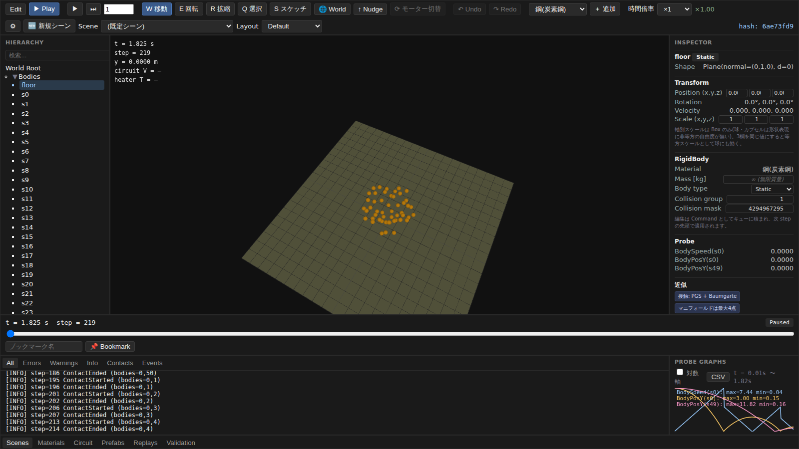
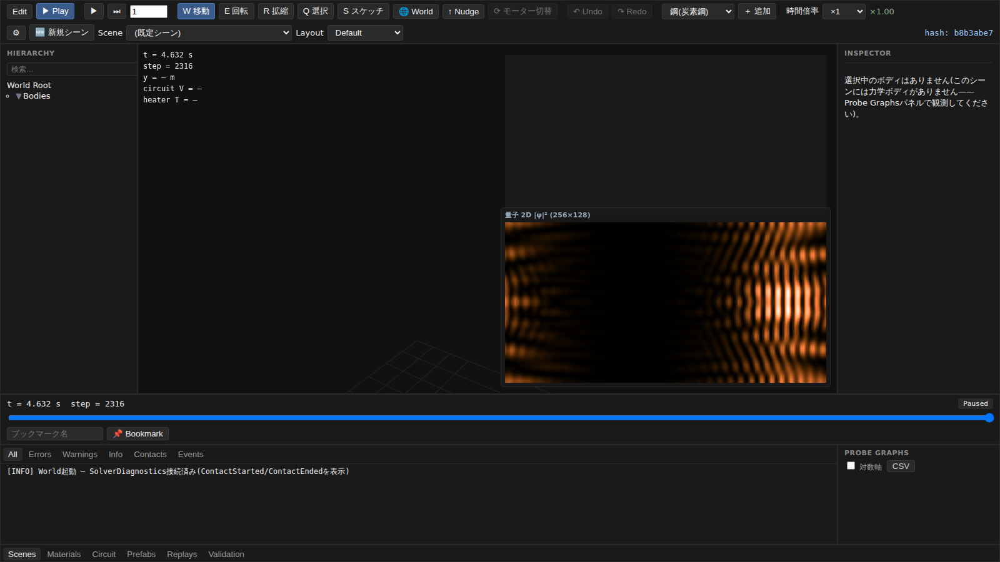

# simulator

**現実の物理法則を、ブラウザ上で組み立てて、動かして、確かめられる物理シミュレータ。**

[](https://github.com/HirokiMorikawa/simulator/actions/workflows/ci.yml)
[](https://www.rust-lang.org/)
[](#対応プラットフォーム)



## 概要

物を落とす、水を注ぐ、熱を伝える、回路に電気を流す、惑星を回す——そうした現象を、ひとつの世界の中に並べて動かせるシミュレータです。物理エンジン本体は Rust で書かれ、WebAssembly にコンパイルされてブラウザ上で動きます。

同種のツールと違うのは、**答え合わせができる**ことです。落下時間は $t=\sqrt{2h/g}$ と一致するか。水柱の底の圧力は $\rho g h$ になるか。閉じた系のエネルギーは保存するか。こうした「教科書の答え」と計算結果を突き合わせる自動テストが 900 件以上あり、見た目がそれらしいかどうかではなく、実際に正しいかどうかで品質を測っています。

## 目次

- [クイックスタート](#クイックスタート)
- [できること](#できること)
- [ドキュメント](#ドキュメント)
- [開発](#開発)
- [コントリビュート](#コントリビュート)

## クイックスタート

事前に必要なのは次の3つです。

| 要件 | 補足 |
|---|---|
| [Rust](https://www.rust-lang.org/tools/install) | rustup 経由での導入を推奨 |
| [Node.js](https://nodejs.org/) 22 以上 | ブラウザデモの実行に使います |
| C コンパイラ | Rust がリンクに使います。Ubuntu なら `build-essential`、macOS なら `xcode-select --install`、Windows なら Visual Studio Build Tools の「C++ によるデスクトップ開発」 |

C コンパイラが入っていない場合は `cargo xtask setup` が最初に検知して、お使いの環境向けの導入コマンドを提示します。

```bash
git clone https://github.com/HirokiMorikawa/simulator.git
cd simulator
cargo xtask setup
cargo xtask dev
```

表示された URL をブラウザで開くとエディタが立ち上がります。

`cargo xtask setup` が、ビルドツールの導入から WebAssembly のビルド、依存パッケージの取得までをまとめて行います。初回は数分かかります。

### 対応プラットフォーム

Linux / macOS / Windows で動作します。物理エンジン本体は OS 依存のコードを含んでおらず、いずれの OS でも CI がセットアップからブラウザでの起動確認までを検証しています。

### 用意されているコマンド

| コマンド | 内容 |
|---|---|
| `cargo xtask setup` | セットアップ一式 |
| `cargo xtask dev` | ブラウザデモを起動 |
| `cargo xtask build-wasm` | WebAssembly をビルド |
| `cargo xtask check` | フォーマット・静的解析・テスト |

## できること

### 幅広い物理をひとつの世界で

力学・流体・熱・電磁気・量子・統計・天体を扱えます。それぞれ独立に動かすこともできますし、領域をまたぐ現象も計算されます——ブレーキの摩擦が熱に変わる、氷が融けて水になる、コイルを回すと発電する、といったつながりです。



<p align="center"><sub>二重スリットを通した電子波の干渉縞</sub></p>

### 3ステップで動かせる

初めて開くと「かんたんモード」が立ち上がります。**① なにを見たい？ → ② どれにする？ → ③ うごかす**の3クリックで、選んだ現象が動き出します。

物理エンジンの用語（Edit / Play モード、Probe、Coupling、dt、時間倍率）は一切出てきません。代わりに、実験ごとに「何が起きるか」「どこを見ればいいか」「いまの数値」が日常の言葉で横に出ます。落とす高さ・坂のかたむき・重力（地球／月／火星）といったつまみを動かせば、その場でやり直します。

現象の時定数はシーンごとに 20 桁以上違う（分子の衝突が 1e-12 秒、惑星の公転が 1e9 秒）ため、進む速さは「1秒あたりに進める step 数」として実験ごとに決めてあります。どれを選んでも、待たずに現象が見えます。

作り込みたくなったら「くわしい編集画面へ」で統合エディタに切り替わり、以後はそちらが既定になります（ツールバーの `🔰 かんたんモード` でいつでも戻れます）。

### 検証済みのデモが 43 本

エディタのギャラリーから選ぶだけで動かせる検証用シーンが 43 本あります。それぞれに「何が起きれば正しいのか」という合否基準が付いています。

| シーン | 内容 |
|---|---|
| **落下時計** | 落下時間が解析解と一致するか |
| **積み木** | 箱を積んで崩す |
| **煙と渦** | 角柱が乱す流れ |
| **注ぐ水** | 容器に水を注ぐ |
| **電気工作台** | 回路をその場で配線する |
| **氷が水になる** | 融解して流体に変わる |
| **二重スリット** | 電子波の干渉 |
| **スイングバイ** | 探査機が惑星の重力で加速する |
| **車の実験場** | タイヤと車体の挙動 |
| **再突入** | 大気圏への突入 |

### ブラウザ上で編集できる

オブジェクトを配置し、材質や初期速度を変え、再生して結果を見る——という一連の作業がブラウザで完結します。時間を巻き戻したり、任意の値をグラフに出して CSV で書き出したりもできます。シーンは JSON として保存・共有できます。

統合エディタはツールバーの `🔰 かんたんモード` と「くわしい編集画面へ」で相互に切り替えられます。パネルの境界はドラッグで動かせ、大きさは次回の起動まで残ります。ショートカットの一覧は `?` キー（またはツールバーの `?`）で開きます。主要な操作はキーボードだけでも辿れます。

### 何度やっても同じ結果になる

同じビルド上では、同じ入力から常にビット単位で同じ結果が得られます。「さっきの現象をもう一度」「パラメータだけ変えて比較」が確実にできるので、リプレイや不具合の再現、回帰テストの土台になっています。

### コマンドラインからも使える

ブラウザを介さず、Rust のライブラリとして直接呼び出すこともできます。

```rust
use sim_world::run_headless_scenario;

let json = std::fs::read_to_string("scenes/d1-free-fall.json")?;
let result = run_headless_scenario(&json, 600)?;
```

## ドキュメント

設計と各物理領域の詳細は [docs/](docs/) にまとめています。63 の文書があり、入口は [docs/README.md](docs/README.md) です。

## 開発

```bash
cargo xtask check   # フォーマット・静的解析・テスト
```

デモアプリ側のビルドと E2E テストは `demo/` で `npm run build` / `npm run test:e2e` を実行します。[CI](.github/workflows/ci.yml) が push と Pull Request ごとに同じ検証を 3 つの OS で自動実行します。

## コントリビュート

Issue / Pull Request を歓迎します。

物理の挙動に関わる変更には、対応するテストを添えてください。このプロジェクトでは「動いているように見える」ことと「正しい」ことを分けて扱っており、後者を担保しているのがテストです。
