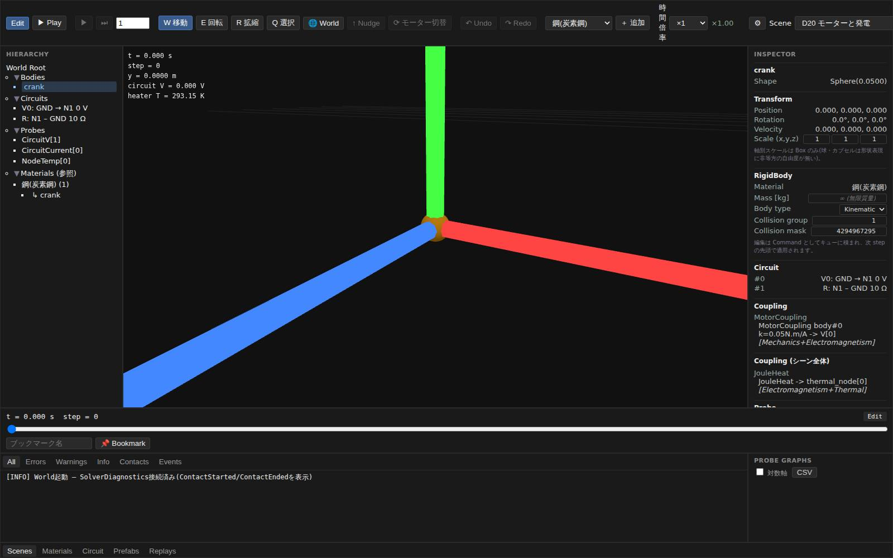
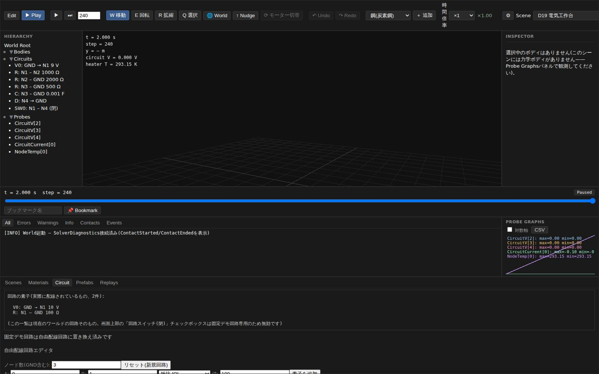
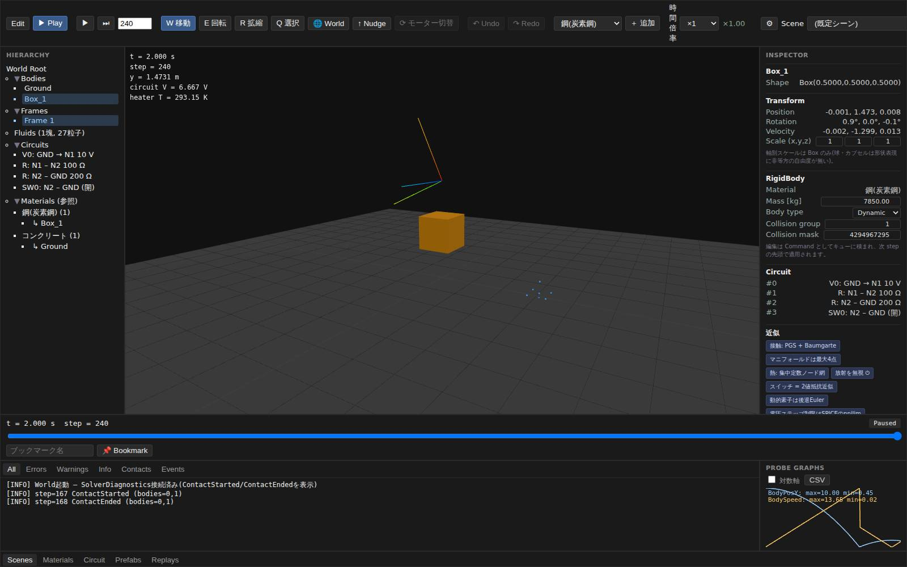

# 品質チェック報告 — UI で物理法則を組み合わせてシミュレーションできるか

対象: `main` head `4e0caaf`(統合エディタの品質チェック報告と、UI 操作経由の QA ハーネスを追加 #72)。
実測日: 2026-08-04。

依頼は「UI で物理法則を組み合わせてシミュレーション可能か、実際に動かして確認してほしい」。
[20-integration/01-coupling-matrix.md](../20-integration/01-coupling-matrix.md) が定義する
ドメイン間結合 15 種と、[23-frontend/01-editor.md](../23-frontend/01-editor.md) が掲げる
エディタの操作を基準に、**実際にブラウザでエディタを操作して**確認した。

先行する [2026-08-04-editor-qa.md](2026-08-04-editor-qa.md) が見たのは単一ドメインの解析解
(自由落下・振り子・ケプラー軌道)だった。**2 つ以上の物理法則を組み合わせたときに正しいか**は
UI 越しに誰も見ていなかった。本報告がその隙間を埋める。検証スクリプトは
[demo/tests/qa/qa-coupling.mjs](../../demo/tests/qa/qa-coupling.mjs)。

---

## 総評

**組み合わせは動く。しかも、橋の両側で数字が合う。** クランクを回して発電し、その電流の
ジュール熱で水槽を温める 3 ドメイン連鎖(D20)は、逆起電力 $V=k\omega$・オームの法則・
$\Delta T = VIt/C$ のすべてが解析解と誤差 1 % 以内で一致した。渦電流ブレーキ(D21)は
$v(t)=v_\infty(1-e^{-t/\tau})$ と誤差 0.012 %、回路の抵抗損失の積分と熱ノードの $C\Delta T$ は
5 桁一致する。決定論もリロードを跨いで保たれる。

**UI からの組み合わせも成立する。** Settings のヒーター、Circuit タブで組み直した回路、
`＋ 追加` の流体は、いずれもシーン側に宣言済みの結合が拾って別ドメインへ量を渡した——
UI で新しく張った 10 V / 100 Ω の回路の 1 W が、シーン(D19)の `JouleHeat` 経由で熱ノードを
解析解どおりに温める。

**崩れているのは境界の扱いと、シーンの作りのほうだった。** SPH の水は境界粒子の床を
すり抜けて落ち続け(D23 では 216 粒子中 208 個)、帯電風船は壁を突き抜けて飛び去り、
D19 の回路はダイオードを 9 V 源に直結していて 7.9 MA が流れる。いずれも結合そのものの
式ではなく、**組み合わせた先の境界条件・シーン記述**の問題である。

| 区分 | 結果 |
|---|---|
| プリセットの結合(§2) | 17 / 23 PASS |
| UI からの組み合わせ(§3) | 12 / 14 PASS |
| 見つかった不具合(§4) | 8 件(重 3・中 3・軽 2) |

---

## 1. 検証方法

前回と同じ実機経路。WASM をビルドして `demo/pkg` へ出力し、Vite 開発サーバを立て、
Chromium を Playwright で駆動した。

| 項目 | 内容 |
|---|---|
| ビルド | Rust 1.94.1 → `cargo build --target wasm32-unknown-unknown --release` + `wasm-bindgen 0.2.126`(`demo/pkg`、1.27 MB) |
| 配信 | `vite dev`(127.0.0.1:5199) |
| ブラウザ | Chromium(SwiftShader)、ビューポート 1600×1000 |
| 操作 | ツールバーの `Scene` 選択・モードトグル・`⏭`・Settings のチェックボックスと数値入力・Project ドロワーのフォーム・`＋ 追加` メニュー・Timeline スクラバ |
| シーン | D10, D14, D15, D17, D18b, D19, D20, D21, D23, D25, D26 |

判定に使った値は**すべて UI から到達できるもの**に限った——Probe 履歴(Probe Graphs パネルと
CSV エクスポートが読むのと同じ系列)、HUD、Inspector の Coupling コンポーネント、
Circuit タブのノード電圧表示、Hierarchy の流体粒子数。Rust 側のテスト関数は呼んでいない。

---

## 2. プリセットの結合(17 / 23 PASS)

結合を宣言したシーンをギャラリーから読み込み、`⏭` で決まった step 数だけ進めて、
**橋の両側**(量を出すドメインと受け取るドメイン)を必ず両方読んだ。片側だけでは
「結合が効いた」ことしか言えず、「保存量が正しく渡った」ことは言えないため。

### 2.1 合っているもの

| ID | 結合(ドメイン) | 検証 | 実測 |
|---|---|---|---|
| X1-1 | MotorCoupling(力学→電磁) | 逆起電力 $V=k\omega$ | 0.5000 V(解析 0.5 V) |
| X1-2 | 同上 | オームの法則 $I=V/R$ | −0.05000 A(解析 −0.05 A) |
| X1-3 | JouleHeat(電磁→熱) | $\Delta T = VIt/C$ | 1.2500×10⁻⁴ K(解析 1.2500×10⁻⁴ K) |
| X2-1 | DissipationToHeat(力学→熱) | 摩擦で静止 | 3.0 → 0 m/s、滑走 0.7527 m |
| X3-1 | InductionCoupling(力学↔電磁) | $v(t)=v_\infty(1-e^{-t/\tau})$、$v_\infty=mgR/B^2l^2$ | 5.4646 m/s(解析 5.4640、誤差 0.012 %) |
| X3-2 | 同上 | 自由落下より遅い | 5.4646 < 5.8840 m/s(7.1 % 減) |
| X4-1 | 回路(MNA) | 分圧則 | $V_2$ = 6.0000 V(解析 6 V) |
| X4-2 | 回路(動的素子) | RC 放電 $V_0e^{-t/RC}$ | 1.6951 V(解析 1.6718 V、後退 Euler の数値減衰ぶん) |
| X4-3 | JouleHeat(回路→熱) | $\int\Sigma V^2/R\,dt = C\Delta T$ | 0.17517 J = 0.17517 J(差 0.00 %) |
| X5-1 | BoussinesqBuoyancy(熱→流体) | 温度差が浮力を生む | 平均鉛直速度 1.9×10⁻³ → 0.571 m/s(単調増加) |
| X6-1 | PhaseChangeMorph(熱→相変化→流体) | 融けた質量が SPH 粒子になる | 0 → 17 粒子(t = 20 s) |
| X6-2 | 同上 | 融解潜熱ぶん水槽が冷える | 350.00 → 348.48 K |
| X7-1 | GridFluidRigid(流体↔剛体) | 渦が立ち、剛体が押される | 渦度 rms 最大 0.0871 m/s、障害物 x 0.4000 → 0.4017 m |
| X8-1 | BrownianForce(熱→力学) | 等分配則 $\langle v^2\rangle = 3k_BT/m$ | 2.789×10⁻⁶ m²/s²(解析 2.761×10⁻⁶、比 1.010) |
| X9-1 | PistonGas(力学↔気体) | 膨張につれ加速が鈍る | Δv(50→100 step) 0.186 > Δv(340→390 step) 0.009 m/s |
| X10-1 | ImageChargeForce(静電→力学) | 鏡像力が壁へ引き寄せる | x 0.2000 → 0.1138 m(60 step) |

3 ドメインを貫く D20 は特に確かめる価値があった——キネマティックなクランク($\omega$ = 10 rad/s)が
電圧を作り、その電流が抵抗で熱になるまで、**途中で誰も量を落としていない**。



*Inspector が、選択した剛体に効く結合(`MotorCoupling` / Mechanics+Electromagnetism)と、
剛体に紐づかないシーン全体の結合(`JouleHeat` / Electromagnetism+Thermal)を別々に出している。
組み合わせが UI から見えるという点は設計どおりに機能している。*

### 2.2 合っていないもの

| ID | 検証 | 実測 | 判定 |
|---|---|---|---|
| X2-2 | 停止までに熱へ渡った量 = 失われた運動エネルギー | 36,976 J / 35,325 J(+4.7 %) | FAIL(不具合 1) |
| X2-3 | 静止した物体は発熱しない | 静止後さらに 1,573 J、T 330.13 → 331.70 K | FAIL(不具合 1) |
| X4-4 | ダイオード枝の電流が妥当な範囲 | 電源電流 −7.875×10⁶ A | FAIL(不具合 3) |
| X8-2 | アンサンブル MSD が UI から読める | 1.584×10⁻¹⁷ m²(解析 3.593×10⁻¹⁸ m²) | FAIL(不具合 6) |
| X10-2 | 風船が壁に貼りつく | x = −10.632 m(壁を突き抜けて飛び去る) | FAIL(不具合 4) |

補助的に、`Coupling` ではないが「水と容器を組み合わせる」操作として D23(注ぐ水)も見た。

| ID | 検証 | 実測 | 判定 |
|---|---|---|---|
| X8b-1 | 水が境界粒子の床に溜まる | t=1.0 s で 216 粒子中 208 個が床より 0.1 m 下 | FAIL(不具合 2) |

---

## 3. UI からの組み合わせ(12 / 14 PASS)

「ユーザーがエディタの操作だけで別のドメインを足したとき、既存の結合がそれを拾うか」を見た。

| ID | 操作 | 実測 | 判定 |
|---|---|---|---|
| Y1-1 | Hierarchy で剛体を選ぶ → Inspector の Coupling | `MotorCoupling body#0 k=0.05N.m/A -> V[0]` | PASS |
| Y1-2 | シーン全体の結合も別枠で出る | `JouleHeat -> thermal_node[0]` | PASS |
| Y2-1 | Settings のヒーター(2 kW)を入れる | ΔT = 2.000 K(解析 2.000 K) | PASS |
| Y3-1 | Settings で重力を 1.62 m/s² へ | 渦電流ブレーキ後 0.9027 m/s(解析 0.9026) | PASS |
| Y4-1 | Circuit タブで 10 V + 100 Ω を張る | `Node1: 10.000V` | PASS |
| Y4-2 | その損失 1 W をシーンの `JouleHeat` が拾う | ΔT = 0.0020 K(解析 0.0020 K) | PASS |
| Y5-1 | `＋ 追加 → 流体` で SPH を足す | 27 粒子 | PASS |
| Y5-2 | 足した水が床に受け止められる | 27 粒子中 20 個が床より 0.5 m 下 | FAIL(不具合 2) |
| Y6-1 | Project の Import で剛体が増える | 2 → 4 体 | PASS |
| Y6-2 | Import が `couplings` も取り込む | coupling_count 0 → 0 | FAIL(不具合 5) |
| Y7-1 | Timeline スクラブで熱の状態も戻る | T 293.150175 → 293.150094 K(その時刻の Probe 値と一致) | PASS |
| Y7-2 | 回路の動的状態(コンデンサ)も戻る | $V_3$ = 0.1704 V(5 s 時点は 4.1×10⁻⁴ V) | PASS |
| Y8-1 | 結合シーンの決定論(リロードを跨ぐ) | `0af3def938ef4d42` 一致 | PASS |
| Y8-2 | 台帳の残差が発散しない | D10 4.3×10⁻² / D19 6.7×10⁻² / D14 6.7×10⁻² | PASS |

Y4 は**エディタで新しく物理を組み立てて既存の結合に食わせた**例なので、判定の中で最も
「組み合わせ可能か」に直接答えている。回路そのものを UI で作り直しても、シーンが宣言した
`JouleHeat` は新しい回路の抵抗を見つけて熱ノードへ 1 W を渡し続けた。



*Project ドロワーの Circuit タブ。ノード数を決めて素子を足すフォームで回路を組み、
ノード電圧がその場で出る。ここで組んだ回路の損失が熱ドメインへ渡る。*

### UI から「結合そのもの」は作れない

エディタで足せるのは**ドメイン**(流体・回路・熱源)までで、**ドメイン間の橋(`Coupling`)を
新しく張る手段は UI に無い**。Inspector の Coupling コンポーネントは読み取り専用、
`＋ 追加` メニューにも結合の項目は無く、結合入りのシーン JSON を Import しても
`couplings` は捨てられる(不具合 5)。したがって現状の答えは:

- **宣言済みの結合を持つシーンを読み込んで、UI から操作・パラメータ変更する** → できる
- **UI 上でゼロから 2 つの法則を結び付ける** → できない(シーン JSON を書く必要がある)

---

## 4. 見つかった不具合

### 不具合 1(重): 静止した物体が発熱し続ける — `DissipationToHeat`

D10(摩擦の熱)の箱は step 61 で止まるが、熱ノードの温度はそこから **step 121 まで
上がり続ける**(330.13 → 331.70 K、+1,573 J)。増分は 26.2 J/step で、これは
$\frac12 m(g\Delta t)^2 = \frac12\cdot7850\cdot(9.80665\cdot0.008333)^2 = 26.2$ J と一致する——
**接触の法線インパルスが毎 step 打ち消す「重力ぶんの速度増分」が散逸として計上されている**。
発熱が止まるのは物理的な理由ではなく、0.5 秒後にスリープ
([crates/sim-mechanics/src/sleep.rs](../../crates/sim-mechanics/src/sleep.rs):`SLEEP_TIME_THRESHOLD`)が
接触解決ごと止めるからである。滑走中も同じ寄与が乗るため、停止時点で熱は既に
運動エネルギーより 4.7 % 多い。

[crates/sim-mechanics/src/solver.rs:64-73](../../crates/sim-mechanics/src/solver.rs) は
`last_contact_dissipation` が約 9 % 過大であることを既知の限界として記録し、原因を
Baumgarte の測定窓に帰しているが、**実測で見えた形は「静止した物体が発熱する」**であり、
UI では箱が完全に止まったまま温度計だけが上がり続ける。$\frac12 m(g\Delta t)^2$ という
きれいな形をしている以上、測定窓から重力インパルスぶんを除くだけで消せる見込みがある。

### 不具合 2(重): SPH の水が容器の床をすり抜ける

D23(注ぐ水)を 2000 step 進めると、**216 粒子中 208 個が床(y=0 の境界粒子層)より
0.1 m 下**にあり、そのまま自由落下を続ける。UI では水が容器を通り抜けて視界から消える。

既存の Rust テスト
(`run_headless_scenario_pouring_water_keeps_interior_density_near_rest_density`)は
**probe が指す 2 粒子(index 0 と 215)についてのみ** `y > 0` を確認しており、この 2 個は
たまたま残る側だったため、漏れは検出されていない。

`＋ 追加 → 流体` で UI から足した水塊(27 粒子)も同じで、2 秒で 20 個が床下へ抜ける
(Y5-2)。境界粒子は 1 層・間隔 = 粒子間隔で、WCSPH の単層境界が高速の粒子を止めきれない
のが原因と思われる。



*`＋ 追加 → 流体` で足した SPH 水塊(Hierarchy に「Fluids (1塊, 27粒子)」)。2 秒後には
塊がばらけ、多くが床より下へ抜けている。*

### 不具合 3(重): D19 の回路がダイオードで 9 V 源を短絡している

`scenes/d19-electric-workbench.json` は、9 V 源のノード N1 を閉じたスイッチ SW0 で N4 へ
つなぎ、N4 → GND にダイオードを置いている。直列抵抗が無いため順方向のダイオードが
電源を短絡し、**電源電流は −7.875×10⁶ A**(スイッチのオン抵抗で決まる値)になる。
Probe グラフにこの値がそのまま出るが、警告は何も出ない。

さらに、この枝の損失は熱へ渡らない——`JouleHeat` は
[crates/sim-coupling/src/joule_heat.rs](../../crates/sim-coupling/src/joule_heat.rs) のとおり
**抵抗素子の $\Sigma V^2/R$ だけ**を合計するので、スイッチとダイオードが飲んだ約 62 MW は
熱ノードにも台帳にも現れない。回路→熱の橋は、抵抗以外の素子については閉じていない。

### 不具合 4(中): D26 の帯電風船が壁を突き抜けて飛び去る

`ImageChargeForce` は $d\le0$ で力を切る(平板前方でのみ意味を持つ近似式のため)が、
**シーンに壁の剛体が無い**ので風船は x=0 を通過し、そのとき得た速度のまま無重力空間を
飛び続ける(400 step で x = −10.6 m)。設計 §2 が謳う「風船が壁に貼りつくデモ」に
なっていない。壁として静的な Plane 剛体を 1 つ置けば直る。

### 不具合 5(中): Import が結合・熱・回路を捨てる

Project ドロワーの Import は `WasmWorld::import_scene_json` を呼び、**`bodies` と `probes`
だけ**を既存ワールドへ足す。`couplings` / `thermal` / `circuit` / `fluids` は黙って捨てられる
(D10 を Import しても `coupling_count` は 0 のまま)。UI 上は「2 体を追加しました」と出る
だけなので、**結合が落ちたことがユーザーに伝わらない**。せめて捨てたセクションを
Console に出すべきである。

### 不具合 6(中): 座標が f32 なのでナノメートルの現象は UI から測れない

`body_position_at_f32` が f32 で座標を返すため、粒子列の端(x = 0.299 m)での刻みは
3.0×10⁻⁸ m。D25(ブラウン運動)の変位は 2×10⁻⁹ m オーダーで、量子化ノイズに埋もれる
——300 粒子のアンサンブル MSD を UI から計算すると解析解 $6Dt$ の 4.4 倍になった
(測っているのは量子化誤差)。等分配則($\langle v^2\rangle$、速度は 10⁻³ m/s オーダーなので
f32 で足りる)は UI から検証できたので、**「熱→力学の結合が正しいか」は UI から一応
言える**が、拡散の定量検証は現状の API では届かない。

### 不具合 7(軽): HUD の `circuit V` / `heater T` がシーンに追随しない

HUD は固定で `circuit_divider_voltage()`(既定シーンの分圧点 = ノード 2)と
`heater_node_temperature()`(熱ノード 0)を出す。D20(2 ノード回路)を読み込むと
`circuit V = 0.000 V` と表示されるが、実際の発電電圧は 0.5 V である(Probe には出る)。
また `heater T` は小数 2 桁固定なので、D20 の ΔT = 1.25×10⁻⁴ K のような変化は
HUD 上まったく動かない。ドメインを組み合わせたシーンほど HUD が嘘をつく。

### 不具合 8(軽): `favicon.ico` の 404

起動のたびに Console に 404 が 1 件出る。実害は無いが、Console の Errors タブに常に
1 件溜まるため、本物のエラーの発見を鈍らせる。

---

## 5. 再現方法

```bash
# 1. WASM を用意する
cargo build --release --target wasm32-unknown-unknown -p sim-wasm
wasm-bindgen --target web --out-dir demo/pkg target/wasm32-unknown-unknown/release/sim_wasm.wasm
#   (wasm-pack が使える環境なら従来どおり
#    wasm-pack build crates/sim-wasm --target web --out-dir ../../demo/pkg でよい)

# 2. 開発サーバ
cd demo && npm ci && npx vite --port 5199 --strictPort --host 127.0.0.1 &

# 3. 検証
cd tests/qa && node qa-coupling.mjs
```

`qa-coupling.mjs` は上記 8 件が未修正のあいだ 29/37 PASS で終わる(FAIL は
X2-2 / X2-3 / X4-4 / X8-2 / X8b-1 / X10-2 / Y5-2 / Y6-2)。修正が入れば PASS に転じるので、
そのまま回帰確認に使える。
