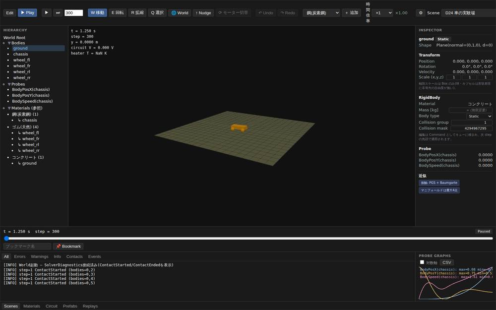
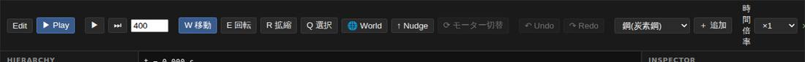
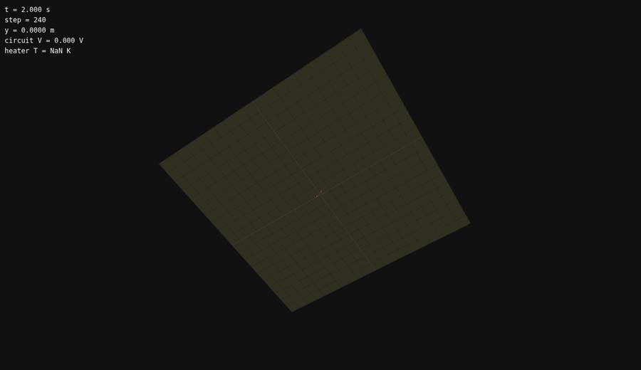
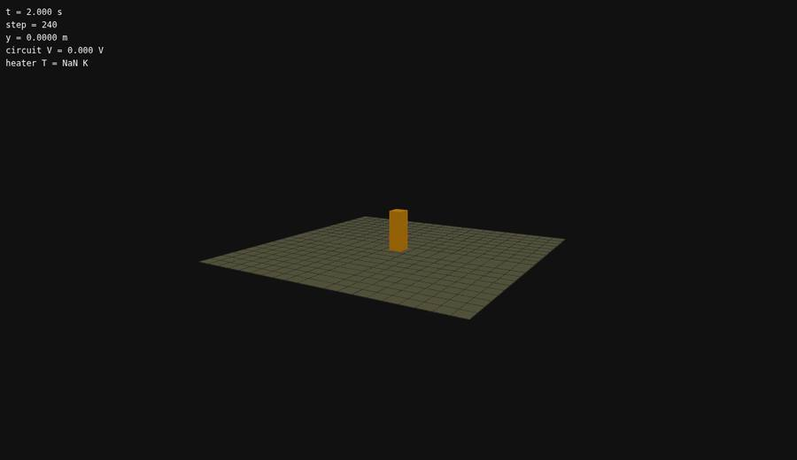
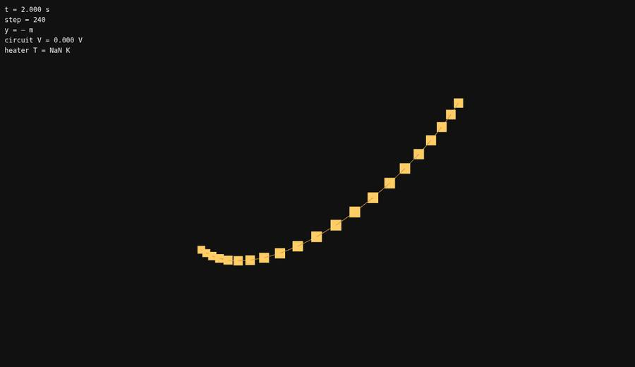
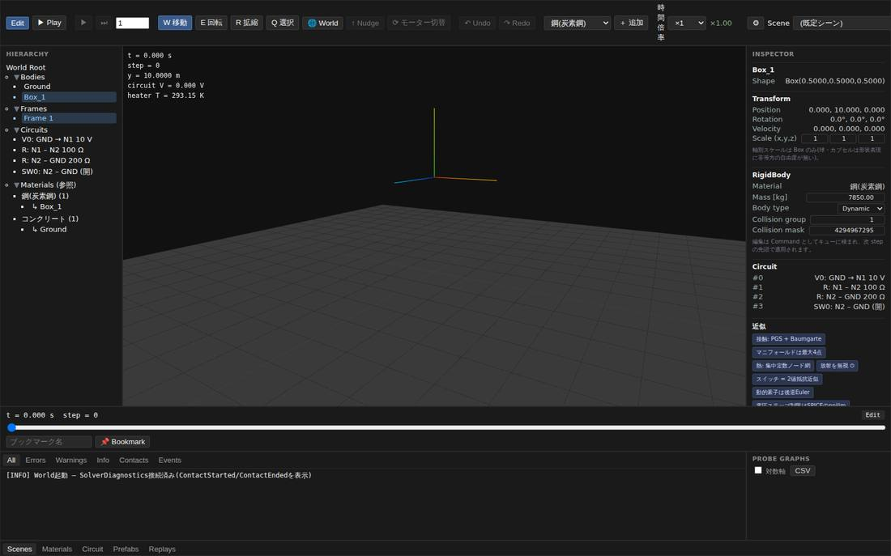
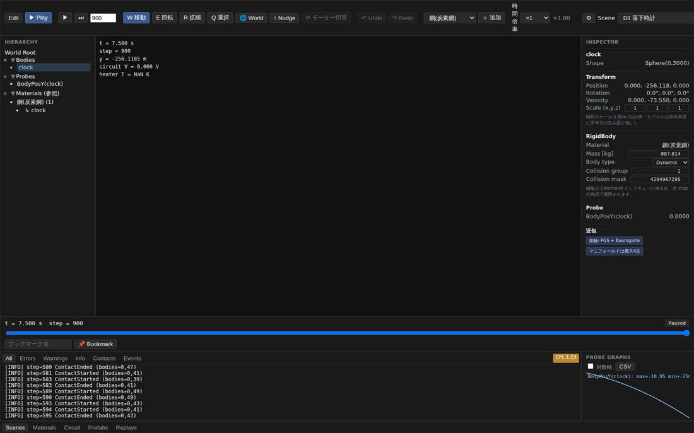

# 統合エディタ 品質チェック報告 — UI を操作して物理法則が確かめられるか

対象: `main` head `88dda1d`(sim-fluid: 3D格子流体に MGPCG を実装 #71)。
実測日: 2026-08-04。

依頼は「UI を操作して Unity のような操作感で物理法則を確認できるか」。
[23-frontend/01-editor.md](../23-frontend/01-editor.md) が掲げる Unity Editor 相当の操作性と、
[21-verification/03-demo-scenarios.md](../21-verification/03-demo-scenarios.md) の合格基準を
基準に、**実際にブラウザでエディタを操作して**確認した。

検証スクリプトは [demo/tests/qa/](../../demo/tests/qa/) に置いてある。

---

## 総評

**物理エンジンとしては、UI から触っても正しい。** 自由落下・反発・斜面・単振り子・
ケプラー軌道・理想気体まで、すべて解析解に対して誤差 1 % 以内で一致した。
決定論も、同一操作の再実行とページ再読み込みを跨いで状態ハッシュが完全一致する。
エネルギー台帳の residual も 10⁻⁶ 台に収まっている。

**崩れているのは「見せ方」と「届かせ方」のほうだった。** カメラの自動フレーミングが
静的な床を対象に含めてしまうため、観察対象が画面の数 % しか占めない、あるいは床の下に
潜って完全に見えなくなる。1280 px 幅ではツールバーの右半分に手が届かず、シーンの切り替えすら
できない。どちらも物理コアではなく `demo/src/main.ts` と CSS の問題で、修正範囲は狭い。

| 区分 | 結果 |
|---|---|
| 物理法則 | 19 / 19 PASS |
| 操作性 | 28 / 28 PASS |
| 不具合 | 9 件(重 2・中 5・軽 2) |

---

## 1. 検証方法

実機と同じ経路で確認した。`wasm-pack` で WASM をビルドして `demo/pkg` へ出力し、
Vite 開発サーバを立て、Chromium を Playwright で駆動している。

物理量の判定は**すべて UI 操作の結果として読み出した値**で行った。シーンはツールバーの
`Scene` 選択から読み込み、時間はモードトグルと `⏭` ボタンで進め、値は Probe 履歴・HUD・
ハッシュ表示から取得している。Rust 側のテスト関数は一切呼んでいない。

| 項目 | 内容 |
|---|---|
| ビルド | wasm-pack 0.13.1 / Rust 1.94.1 → `demo/pkg`(1.27 MB) |
| 配信 | `vite dev`(127.0.0.1:5199) |
| ブラウザ | Chromium(SwiftShader、描画 13 fps)、ビューポート 1600×1000 |
| 操作 | 実マウス入力(中/右ドラッグ・ホイール・ギズモのドラッグ)と実キー入力 |
| シーン | D1, D3, D4, D5×2, D8, D11, D12, D13, D24, D30, D34, D36 |

描画が 13 fps しか出ないのはヘッドレスのソフトウェア GL によるもので、実機の性能ではない。
実効時間倍率の表示は ×1.00 を保っており、この負荷でも物理は実時間に追従していた。

---

## 2. 物理法則の検証(19 / 19 PASS)

各シーンをギャラリーから読み込み、`⏭` で決まった step 数だけ進めて Probe 履歴から数値を取った。

| ID | 検証 | 解析解 | 実測 | 誤差 |
|---|---|---|---|---|
| P1-1 | D1 自由落下 — 位置 | $y = y_0 - \frac{1}{2}gt^2$ | $t=3.0167$ s で $y=-24.7449$ m(解析 $-24.6216$) | 0.62 %(落下高 20 m 比) |
| P1-2 | D1 自由落下 — 落下時間 | $t = \sqrt{2h/g}$ | 2.0071 s(解析 2.0196 s) | −0.62 % |
| P2-1 | D3 反発 — 第1バウンド | 高さ比 $= e^2$ | 1.90 m → 1.2335 m、比 0.6492 | 実効 $e = 0.806$(材料値 0.8) |
| P2-2 | D3 反発 — 第2バウンド | 高さ比 $= e^2$ | 比 0.6513 | 実効 $e = 0.807$ |
| P3-1 | D5 斜面 10° — 静止 | $\tan\theta < \mu_s$ | 5 s 後の速さ 0.000 m/s | 完全静止 |
| P3-2 | D5 斜面 45° — 滑走 | $\tan\theta > \mu_s$ | 5 s 後 13.87 m/s | 滑り出しを再現 |
| P3-3 | D5 斜面 45° — 加速度 | $a = g(\sin\theta - \mu_k\cos\theta)$ | $a \approx 2.764$ m/s² | 摩擦なし 6.934 / $\mu_k$=0.5 で 3.467 の間 |
| P4-1 | D11 単振り子 — 周期 | $T = 2\pi\sqrt{L/g}$ | 2.0067 s(解析 2.0064 s) | 0.01 % |
| P4-2 | D11 単振り子 — 保存 | 振幅が減衰しない | 0.04998 m(初期値と一致) | residual 1.535×10⁻⁶ |
| P5-1 | D34 円軌道 — 半径 | A2 保存則 | $r = 1.00000$〜$1.00002$ au | 変動 0.002 % |
| P5-2 | D34 公転周期 | ケプラー第3法則 | 365.83 日(理論 365.25 日) | 0.16 % |
| P8-1 | D30 気体の箱 | $p = NkT/V$ | $T$=313.13 K で $p = 1.7313\times10^3$ Pa | +0.12 % |
| P9-1 | D11 エネルギー台帳 | residual ≈ 0 | 5 s 走行後 1.535×10⁻⁶ | 台帳が機能 |
| P7-1 | 重力パラメータの反映 | Settings → 物理 | $g$=1.62 で $y=16.7465$ m(解析 16.7600) | 月面重力が正しく効く |

### 決定論とリプレイ

| ID | 検証 | 結果 |
|---|---|---|
| P6-1 | 同一シーン・同一 step 数を 2 回 | `cd61bcdc70c55c4e` = `cd61bcdc70c55c4e` |
| P6-2 | ツールバーのハッシュ表示と World の一致 | UI 表示 = `state_hash()` |
| P6-3 | ページ再読み込みを跨いだ再現 | `cd61bcdc70c55c4e` で一致 |
| P0-2 | `⏭` が要求ちょうどの step を進める | 240 要求 → 240 step |

*D24 車の実験場を 300 step(1.25 秒)走らせたところ。WheelJoint で 4 輪が接地し、
Probe グラフに chassis の位置と速度が出ている。物理は動いているが、
対象は画面のごく一部にしか映らない(不具合 2)。*

---

## 3. 操作性の検証(28 / 28 PASS)

Unity Editor の操作を基準に、実際のマウス／キー入力で 1 つずつ確かめた。以下はすべて通っている。

| 分類 | 操作 | 実測 |
|---|---|---|
| カメラ | 中ドラッグ回転・右ドラッグパン・ホイールズーム | Δ\|camera\| 13.7 m / 12.82→9.73 |
| カメラ | `F` キーで選択物にフォーカス | 画面外 y=−162 → 画面内 y=407 |
| ツール | `W`/`E`/`R` でギズモ 1 つ、`Q` で非表示 | W=1 E=1 R=1 Q=0 |
| ツール | ツールボタンの active 表示がキーに追従 | — |
| ツール | Gizmo 座標系ボタン(World/Local) | ボタンクリックのみ有効(→ 不具合 7) |
| Gizmo | Translate の軸ドラッグ | x 0.000 → 1.400(y,z 不動) |
| Gizmo | Rotate リングのドラッグ | quat w 1.000 → 0.901 |
| Gizmo | Scale ハンドルのドラッグ | Box(0.5) → Box(0.7232) 等方 |
| Gizmo | Undo / Redo(移動・スケール) | 往復とも一致 |
| モード | Edit で再生ロック、Play でギズモ非表示 | 設計 §4 どおり |
| モード | Play 中に剛体をドラッグして掴む | Command 経由の Grab |
| 選択 | Hierarchy ↔ Inspector ↔ Scene View の同期 | 双方向とも成立 |
| 選択 | Scene View のクリックピック | 床 → 箱へ選択が移る |
| 編集 | Scene View 右クリックのスポーンパレット | 球/箱/カプセル/材質 |
| 編集 | Hierarchy 右クリック(複製・削除・アイソレート・プレハブ化) | 2 → 3 体 |
| Timeline | ブックマーク登録・スクラブで巻き戻り | t 5.300 → 1.000 s |
| Console | 6 種のタブで絞り込み | All 38 / Contacts 37 |
| その他 | `Escape` でコンテキストメニューが閉じる | — |

Gizmo は移動・回転・スケールの 3 つとも実際のドラッグで反応し、移動とスケールは
Undo / Redo で往復して元の値に戻る。Play モードでの掴みが Command キュー経由になっている点、
Edit モードで再生系ボタンが確実にロックされる点も設計どおりだった。

---

## 4. 見つかった不具合

重い順に並べた。いずれも物理コアではなくフロントエンド側で閉じている。
再現は [demo/tests/qa/qa-defects.mjs](../../demo/tests/qa/qa-defects.mjs)(F1〜F9 が下の 1〜9 に対応)。

### 不具合 1(重) — ツールバーが横にあふれ、Settings・Scene・Layout・ハッシュに到達できない

ツールバーの内容幅は 1966 px。1280×800 では表示幅 1278 px に対し **688 px がはみ出し**、
`⚙ Settings`・`Scene` 選択・`Layout` 選択・状態ハッシュ表示が画面外に出る。
`overflow-x: visible` のため横スクロールでも救えず(`scrollLeft` は 0 のまま)、
その解像度では**シーンの切り替えも重力・dt の変更も一切できない**。1920×1080 でもなお 48 px あふれる。

あわせて「時間倍率」ラベルが 1 文字ずつ折り返して縦書きになり、ツールバー高が 82 px に膨らんでいる。

- 再現: ウィンドウ幅 1280 px でエディタを開く
- 実測: 内容幅 1966 px / 表示幅 1278 px、`scrollLeft` = 0、ラベル高 72 px
- 該当: `demo/index.html` のツールバー構成、`demo/src/style.css` の `#toolbar`

*1280×800。右端は「+ 追加 / ×1 / 時間倍率」で途切れ、Settings と Scene 選択には到達できない。*

### 不具合 2(重) — 自動フレーミングが床まで含めるため、対象が極小になる/床の下に潜る

`frameCameraOnContent()`(`demo/src/main.ts:2994`)は `bodyMeshes` 全体のバウンディングボックスを
取るが、そこに **20 m × 20 m の静的な床メッシュ**が含まれる。結果として注視距離が対象ではなく
床の大きさで決まり、D4 積み木(高さ 3 m)は画面のごく一部にしか映らない。

さらに視線方向を前のシーンから引き継ぐ仕様のため、注視点が下がるシーンではカメラが床の下に
潜り込む。D12 ラグドールでは**カメラ y = −31.23 m** となり、15 剛体の人形は床に隠れて
1 ピクセルも見えない — 「エネルギー単調減少・可動域維持」を目視で確かめるためのシーンが、
目視できない状態になっている。

- 再現: シーンギャラリーから D12 / D13 / D11 を読み込む
- 実測: カメラ y = D11 −0.49 / D12 −31.23 / D13 −1.15。動的ボディの画面占有は D4 で 1.3 %
- 該当: `demo/src/main.ts:2994` `frameCameraOnContent()`

|  |  |
|---|---|
| D12 ラグドール(240 step 後)。床の裏側だけが見え、人形は不可視。赤い点は接触点オーバーレイ。 | D4 積み木(240 step 後)。物理は正しく 3 段が立っているが、床が画角を支配して対象は数 % しかない。 |

同じ経路でも D13 ロープはカテナリーがきれいに収まる。**壊れているのはフレーミングの計算であって
描画ではない。**

*D13 ロープ。床メッシュを持たないシーンでは自動フレーミングが正しく働く。*

### 不具合 3(中) — 起動直後の既定シーンで、落下する箱が画面外にある

自動フレーミングはギャラリーシーンの読み込み時にしか呼ばれない(`demo/src/main.ts:4170` 付近)。
既定シーンの箱は $y = 10$ m に置かれるが、カメラは `position.set(6, 4, 10)` の固定値のままで、
箱の投影位置は画面上端より 162 px 上。**エディタを開いて最初に見えるのは、何も乗っていない床だけ**になる。

- 実測: Box_1 (0, 10, 0) の投影 y = −162 px(キャンバス上端 83 px)

*起動直後。Hierarchy と Inspector は Box_1 を選択済みで、Gizmo も出ているのに、箱そのものは画角の外。*

### 不具合 4(中) — シーンを切り替えても Console が消えず、存在しないボディを指す行が残る

シーン切替時に Console のログがクリアされない。D8 散乱(51 体)を 600 step 走らせたあと
D1 落下時計(**ボディ 1 体・床なし・接触が起こりえない**)を読み込むと、
`ContactStarted (bodies=0,47)` のような行が 200 件そのまま残る。

これらの行はクリックすると発生源ボディの選択と Timeline ジャンプを行う仕様(設計 §1.5)なので、
現シーンに存在しない index を指したまま操作可能な状態になる。クリックしても例外は出ないが、
無関係なボディが選択される。

- 再現: D8 散乱を 600 step → D1 落下時計を読み込む
- 実測: 切替後も Console 200 行が残存。現シーンの `body_count` = 1

*Scene は「D1 落下時計」、Hierarchy は clock 1 体のみ。それでも Console には前シーンの
step=580〜595 の接触ログが並ぶ。HUD の `heater T = NaN K`(不具合 8)も同時に見える。*

### 不具合 5(中) — `⏭`(N step 送り)が再生中は押しても何も起きない

ハンドラ(`demo/src/main.ts:4823`)が `if (mode === "play" && !playing)` で早期に抜けるが、
ボタンは有効なまま(`disabled` は Edit モードでしか立たない、`setMode()` は `demo/src/main.ts:3785`)。
押しても反応がないだけで、理由の表示もない。Unity の Step は「一時停止して 1 フレーム進める」ため、
同じつもりで押すと空振りする。

さらに Play モードへ入ると即座に `playing = true` になるので、
**N step 送りを使うには毎回まず一時停止する必要がある**という導線になっている。

- 実測: 1 / 10 / 50 / 500 のいずれを指定しても step 差は自由走行分のみ

### 不具合 6(中) — Unity 標準のショートカットが未実装

キーボードハンドラ(`demo/src/main.ts:2406`)は `event.ctrlKey || event.metaKey || event.altKey` で
即 return するため、修飾キー付きのショートカットが構造的に 1 つも通らない。
実装されているのは `W` / `E` / `R` / `Q` / `F` の 5 つだけ。

| キー | 期待 | 実測 |
|---|---|---|
| `Ctrl+Z` | Undo | x = 1.400 のまま |
| `Ctrl+Y` | Redo | 変化なし |
| `Delete` | 選択物を削除 | 2 体 → 2 体 |
| `Ctrl+D` | 複製 | 2 体 → 2 体 |
| `Space` | 再生/一時停止 | ⏸ → ⏸ |

いずれも機能自体は存在する(ツールバーと右クリックメニューにある)ので、キー割り当ての追加だけで揃う。

### 不具合 7(中) — `X` キー(Gizmo の World / Local 切替)が効かない

ボタンの `title` は「Gizmo の座標系を World / Local で切り替える (X)」、
[README.md](../../README.md) も「`X` で Gizmo の World / Local 切替」と書いているが、
keydown の switch(`demo/src/main.ts:2410`)に `x` の case が無い。**ドキュメントが実装より先に進んでいる。**
ボタンのクリックでは正しく切り替わる。

- 実測: `X` 押下前後とも `data-space="world"`。ボタンクリックでは world → local

### 不具合 8(軽) — HUD が該当ドメインを持たないシーンで NaN と紛らわしい 0 を表示する

HUD(`demo/src/main.ts:5303`)は常に 5 行を出すが、`heater_node_temperature()` は熱ドメインが
無いとき `f64::NAN` を返す仕様(`crates/sim-wasm/src/lib.rs:1659`、Rust 側は意図的)。
フロント側でそのまま整形するため、力学だけのシーンでは `heater T = NaN K` と表示される。

`circuit V = 0.000 V` も同様で、回路の無いシーンでは「測って 0 V だった」ようにも読めてしまう。

- 実測: D1 / D4 / D12 / D24 いずれも `heater T = NaN K`

### 不具合 9(軽) — Probe グラフに時間軸も単位も無く、履歴が 600 サンプルで無言に打ち切られる

プローブ履歴は `DEFAULT_PROBE_CAPACITY = 600` のリングバッファ
(`crates/sim-world/src/scenario.rs:35`)。900 step 走らせても履歴長は 600 のままで、
古い側が黙って捨てられる(D3 は dt=1/240 なので 2.5 秒分しか残らない)。

グラフ側にも軸目盛り・時刻・単位の表示が無いため、**グラフのどこが何秒なのかを画面から知る手段がない**。
CSV エクスポートも同じ 600 サンプルを出す。合格基準の数値読み取りを UI 上で行うには足りない。

なお本 QA でも、この打ち切りを踏んで D3 の「第1バウンド」を数回あとの極大と取り違えた。
容量を超える計測は添字と時刻の対応が崩れる。

- 実測: 900 step 実行後の履歴長 = 600 サンプル。パネル内の文言は「Probe Graphs / 対数軸 / CSV」のみ

---

## 5. 今回は確かめていないこと

- パストレーシング(D40–D43)はオフライン実行のため、エディタからは触れていない。
- 回路サブモード(D19 の自由配線)と Project ドロワーの Prefabs / Replays は、
  存在と開閉のみ確認し、中身の操作までは追っていない。
- 3D 格子流体(D14c)は 64³ で 206.8 ms/step という既知の性能制約があるため、
  対話操作の検証対象から外した。
- タッチ操作・キーボードのみでの操作(アクセシビリティ)は未検証。
